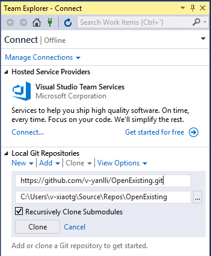
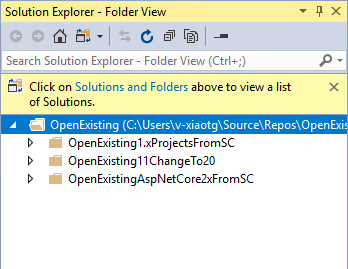
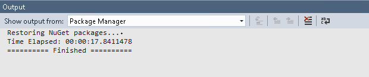
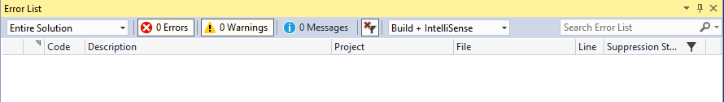
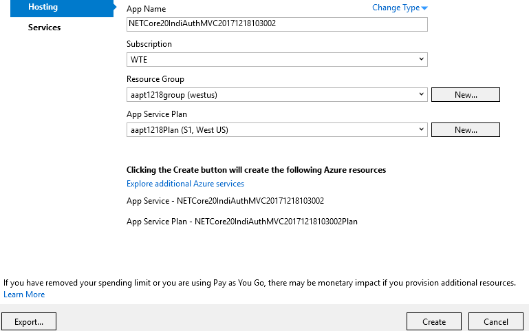
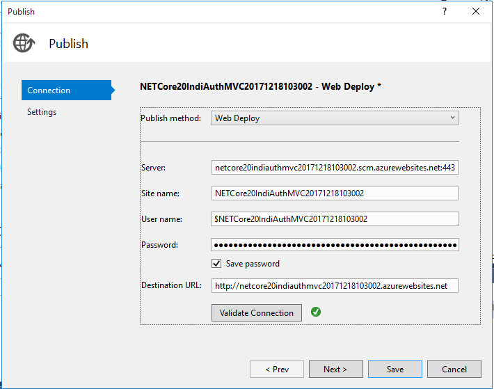
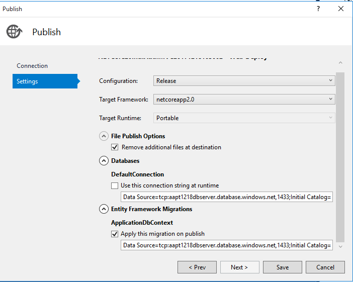
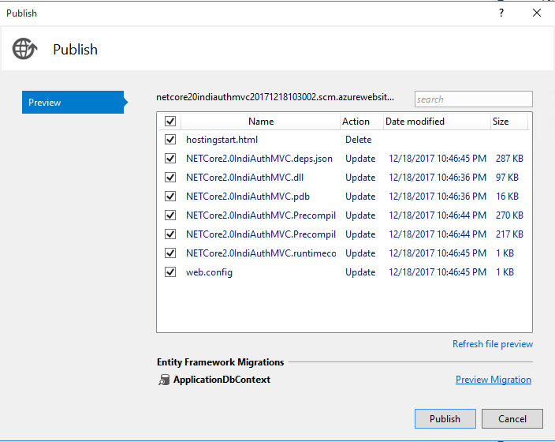
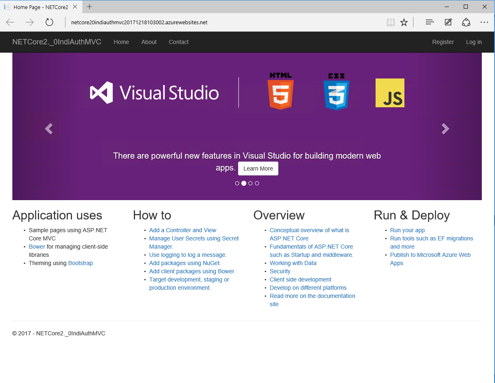


## Walkthrough Steps

### Clone the Git repo in VS 

1. Open Team Explorer, clone the repo under 'Local Git Repositories'.(https://github.com/v-yanlli/OpenExisting.git)

    

2.   The cloned repo will show up in 'Solution Explorer - Folder View'.

     

3. Navigate to the path and open the project in OpenExistingAspNetCore2xFromSC folder as shown in the table above

4. Wait for package restore to complete, verify package restore completes successfully without any error

    - View Output window > package Manager pane in Output window will show restore status

    - Wait till package restore completes

    

### Build the solution and run locally

1. Open Startup.cs, build the project. Verify no errors or warnings in the output window and in the error list

    

2. F5 / Ctrl-F5 to run the project locally and verify page loads in the browser

### Publish to Azure - Create a new web app on Azure and publish this project to Azure

1. Right-click project > Publish, choose Azure App Service > Create New

2. Create New Web app in existing or new Resource Group / App Service Plan. (If you publish a project with InAuth, Provision a database as well in the "Services" tab)

    

3. Click Settings link in Publish pane, navigate to Connection tab > Validate Connection

    

4. Navigate to Settings tab, pick the default options, select "Remove additional files at destination" and click Save. (If you publish a project with InAuth, select EF )

    

5. Click Preview link in Publish pane, click Start Preview

    

6. Publish to Azure, verify index.html page loads properly on published Azure site. 

    

7. If you publish a project with InAuth,  Register a new user on the published site and log in .

    
